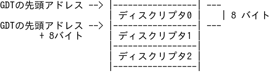

# review-text-imager

Re:VIEW の image ブロックのボディを画像化するツールです。

図を清書する前にとりあえずアスキーアートで図を作りたいことがあります。
review-text-imager を使うとアスキーアートを手軽に画像ファイルに変換できます。

## 使い方

例えば file.re に次のような image ブロックがあるとします。

    //image[gdt-structure][3つのディスクリプタを持つGDTの外観]{
    GDTの先頭アドレス --> |-----------------| ---
                          | ディスクリプタ0 |    | 8 バイト
    GDTの先頭アドレス --> |-----------------| ---
            + 8バイト     | ディスクリプタ1 |
                          |-----------------|
                          | ディスクリプタ2 |
                          |-----------------|
    //}

これを画像化するには次のようにします。

    $ pngnize-image-body file.re gdt-structure

画像化に成功すると次のような画像が `images/gdt-structure.png` に出力されます。

## インストール

review-text-imager の依存パッケージをインストールします。

    $ sudo apt update && sudo apt install imagemagick fonts-ipafont-gothic

※review-text-imager はデフォルトで `IPAゴシック` フォントを利用します。

次に review-text-imager をダウンロードし，各コマンドをパスの通ったところに置くかシンボリックリンクを張ります。

    $ git clone https://github.com/uchan-nos/review-text-imager.git
    $ GITDIR=$PWD
    $ cd path/to/somewhere
    $ ln -s $GITDIR/pngnize-image-body ./
    $ ln -s $GITDIR/extract-image-body ./
    $ ln -s $GITDIR/text2png ./

## Re:VIEW 以外との連携

text2png コマンドは標準入力から受け取った文字列を PNG にするコマンドとして汎用的に使えます。
